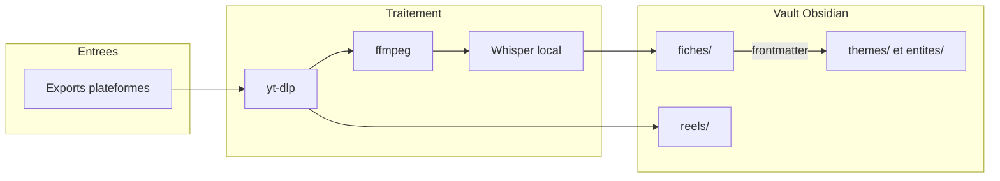

# reels-graph-md

**Transforme des reels sauvegardés (Instagram, TikTok, Facebook) en vault Obsidian consultable : une fiche Markdown par reel, la vidéo lisible dans la note, et une navigation par thème et par entité.**


## Sommaire

- [Le problème](#le-problème)
- [Architecture](#architecture)
- [Documentation](#documentation)
- [Démarrage](#démarrage)
- [Configuration](#configuration)
- [Tests](#tests)
- [Structure du projet](#structure-du-projet)
- [Licences & composants](#licences--composants)
- [Étape 0 — récupérer ses reels sauvegardés](#étape-0--récupérer-ses-reels-sauvegardés)
- [Le vault produit](#le-vault-produit)
- [Dépannage](#dépannage)
- [Limites connues](#limites-connues)

## Le problème

Plusieurs centaines de reels sauvegardés, dont le contenu est enfermé dans de la
vidéo, donc introuvable. Impossible de retrouver *ce reel qui parlait du vote à
l'Assemblée nationale*.

**Périmètre.** Métadonnées du post (dont la légende), transcription audio locale,
vidéo conservée, maillage Obsidian.

**Hors périmètre.** Aucune analyse visuelle : pas de capture de frames, pas d'OCR,
pas de modèle de vision. Ce qui n'est ni dit à voix haute ni écrit dans la légende
n'entrera pas dans le vault — les fiches concernées sont **étiquetées** comme
telles plutôt que de laisser croire à un traitement réussi.

## Architecture

Deux commandes, aucun service tournant, aucune base de données. Le stockage est le
vault Obsidian lui-même ; le seul état structuré est `journal.json`.

| Module | Rôle |
|---|---|
| [`liens.py`](src/reels_graph_md/liens.py) | Extraction, filtrage et normalisation des URLs des exports |
| [`journal.py`](src/reels_graph_md/journal.py) | Reprise après interruption, écriture atomique |
| [`ytdlp.py`](src/reels_graph_md/ytdlp.py) | Métadonnées et téléchargement, avec détection réelle des échecs |
| [`moteur.py`](src/reels_graph_md/moteur.py) | Pont vers le moteur de transcription du skill `watch` |
| [`fiche.py`](src/reels_graph_md/fiche.py) | Assemblage du Markdown, évaluation de fiabilité |
| [`ingest.py`](src/reels_graph_md/ingest.py) | Orchestration — commande `reels-ingest` |
| [`mailler.py`](src/reels_graph_md/mailler.py) | Notes de thème et d'entité — commande `reels-mailler` |



> Détails : [docs/ARCHITECTURE.md](docs/ARCHITECTURE.md)

## Documentation

| Document | Contenu |
|---|---|
| [docs/CADRAGE.md](docs/CADRAGE.md) | Le pourquoi : objectifs, périmètre, hypothèses, décisions, roadmap |
| [docs/ARCHITECTURE.md](docs/ARCHITECTURE.md) | Le comment : composants, flux, décisions techniques, sécurité |
| [CLAUDE.md](CLAUDE.md) | Règles de contribution du dépôt |

## Démarrage

**Prérequis** : Python ≥ 3.12 et uv, plus trois briques externes.

| Outil | Rôle | Installation |
|---|---|---|
| `yt-dlp` | Métadonnées et téléchargement | `uv tool install yt-dlp` |
| `ffmpeg` / `ffprobe` | Extraction audio | `apt install ffmpeg` |
| Serveur Whisper local | Transcription | `claude-skills/local-whisper/speaches-up.sh` |

```bash
uv sync
```

Le moteur de transcription vient du skill `watch`. Il est **importé depuis son
emplacement réel, jamais recopié**, pour continuer à profiter de ses corrections.

```bash
# voir ce qui serait traité, sans rien télécharger
uv run reels-ingest exports/*.json --vault ~/Vault --lister

# tester sur 10 reels avant d'en lancer 300
uv run reels-ingest exports/*.json --vault ~/Vault --cookies firefox --limite 10

# puis le maillage, après enrichissement des fiches
uv run reels-mailler --vault ~/Vault
```

Le script **reprend où il s'est arrêté**. On peut le couper à tout moment : le
journal est réécrit après chaque reel. Relancer la même commande retente uniquement
ce qui a échoué.

## Configuration

Options de `reels-ingest` :

| Option | Défaut | Effet |
|---|---|---|
| `--vault` | `~/Vault` | Racine du vault Obsidian produit |
| `--cookies` | aucun | Navigateur (`firefox`) ou chemin d'un `cookies.txt`. **Obligatoire** pour Instagram et Facebook |
| `--limite` | `0` (tout) | Ne traiter que les N premiers reels restants |
| `--pause` | `3.0` | Secondes entre deux reels, anti rate-limit |
| `--langue` | `fr` | Langue **forcée** pour Whisper |
| `--lister` | — | Afficher ce qui serait traité, sans rien télécharger |

Variables d'environnement :

| Variable | Défaut | Effet |
|---|---|---|
| `REELS_GRAPH_MD_WATCH_SCRIPTS` | `~/mes_projets/claude-skills/watch/scripts` | Emplacement du moteur de transcription |
| `WHISPER_BASE_URL` | `http://localhost:8000/v1` | Serveur Whisper local (lu par le moteur) |
| `WHISPER_MODEL` | modèle par défaut du serveur | Modèle de transcription |

Codes de sortie de `reels-ingest` : `0` terminé, `2` fichier d'export introuvable,
`3` serveur Whisper injoignable, `130` interruption clavier.

## Tests

```bash
uv run pytest
```

**39 tests** sur les fonctions pures : extraction et normalisation des liens,
échappement YAML, évaluation de fiabilité, maillage et son idempotence. Les étapes
réseau ne sont pas testées automatiquement — voir
[docs/CADRAGE.md](docs/CADRAGE.md).

## Structure du projet

```text
reels-graph-md/
├── src/reels_graph_md/       # le package, sept modules
├── tests/                    # tests des fonctions pures
├── docs/
│   ├── CADRAGE.md            # le pourquoi
│   └── ARCHITECTURE.md       # le comment
├── CLAUDE.md                 # règles de contribution
├── pyproject.toml            # uv, Python 3.12, zéro dépendance de production
└── README.md
```

## Licences & composants

| Composant | Rôle | Licence |
|---|---|---|
| yt-dlp | Métadonnées et téléchargement | Unlicense |
| ffmpeg | Extraction audio | LGPL-2.1+ / GPL selon le build |
| faster-whisper (CTranslate2) | Moteur de transcription | MIT |
| speaches | Serveur Whisper compatible OpenAI | MIT |
| pytest | Tests | MIT |
| hatchling | Build | MIT |
| Obsidian | Lecture du vault | Propriétaire, gratuit pour usage personnel |
| **Ce projet** | Code applicatif | MIT — Copyright (c) 2026 floSa |

Le fichier `LICENSE` n'est pas encore présent dans le dépôt. Basé sur les idées de
[sosoj92/reels-vault](https://github.com/sosoj92/reels-vault) (MIT) pour la couche
batch, et sur le skill `watch` (MIT, dérivé de
[claude-video](https://github.com/bradautomates/claude-video)) pour le moteur de
transcription.

---

## Étape 0 — récupérer ses reels sauvegardés

Aucune plateforme n'expose d'API pour les contenus sauvegardés. Le seul chemin
fiable est l'export officiel des données. C'est **manuel et asynchrone** (quelques
heures à quelques jours), et ça se fait une fois.

| Plateforme | Chemin | Fichier attendu |
|---|---|---|
| Instagram | Centre des comptes → Vos informations et autorisations → Télécharger vos informations → **JSON** | `saved_posts.json` |
| TikTok | Paramètres → Compte → Télécharger vos données → *Custom data* → **Likes and Favorites** → JSON | `user_data_tiktok.json` |
| Facebook | Paramètres → Vos informations Facebook → Télécharger vos informations → JSON | *Éléments enregistrés et collections* |

TikTok distingue **Favoris** (le signet — ce qu'on veut) et **J'aime** (autre
volume, beaucoup moins pertinent).

Le format des fichiers n'a aucune importance : ils sont lus **en texte brut** et
attaqués à la regex. txt, csv, json ou html, un seul code les lit tous.

## Le vault produit

```text
Vault/
├── fiches/     insta_DXabc123.md        une fiche par reel
├── reels/      insta_DXabc123.mp4       la vidéo, conservée
├── themes/     politique.md             généré, wikilinks
├── entites/    Assemblée nationale.md   généré, wikilinks
└── journal.json
```

La vidéo est conservée délibérément : c'est elle qui permet de revoir le reel
depuis Obsidian même quand le post d'origine a disparu — ce qui arrive à environ
**un tiers** d'un stock ancien. Compter **1 à 3 Go** pour 300 reels.

Sur les horodatages : contrairement à YouTube, Instagram, TikTok et Facebook
n'honorent pas de paramètre `?t=` dans leurs URLs. Les repères `[MM:SS]` renvoient
donc à la vidéo locale embarquée en tête de fiche, pas au post d'origine.

### Le pipeline

| # | Étape | Automatique |
|---|---|---|
| 1 | Extraction des liens depuis les exports | oui |
| 2 | Filtrage par le journal | oui |
| 3 | Métadonnées (`yt-dlp --dump-json`) | oui |
| 4 | Téléchargement de la vidéo, **une seule passe** | oui |
| 5 | Extraction audio locale (ffmpeg) | oui |
| 6 | Transcription Whisper, **langue forcée** | oui |
| 7 | Écriture de la fiche | oui |
| 8 | Synthèse, thèmes, entités | **LLM, par lots** |
| 9 | Maillage Obsidian (`reels-mailler`) | oui |

Les étapes 1 à 7 tournent sans personne. L'étape 8 est la seule qui consomme du
quota. L'étape 9 est du texte, instantanée.

### Règle éditoriale de l'étape 8

Séparation stricte entre **ce que dit le reel** et **ce qui est établi**. Style
indirect obligatoire (« le reel affirme que… »), jamais de voix assertive. Sur du
contenu politique, une synthèse d'apparence neutre qui reprend une affirmation
militante est un défaut, pas un détail. Une fiche trop pauvre pour un vrai résumé
doit être signalée comme telle, pas comblée.

Les thèmes sont **émergents** : aucune liste prédéfinie, ils se déduisent de ce qui
est lu, en réutilisant les mêmes libellés d'une fiche à l'autre.

## Dépannage

**Problème** : `Failed to decrypt with DPAPI` au moment de lire les cookies.
**Cause** : Chrome 127+ chiffre ses cookies d'une façon que yt-dlp ne sait pas
déchiffrer sous Windows. **Solution** : utiliser Firefox. Il n'y a pas de
contournement.

**Problème** : les cookies ne sont pas lus, ou le fichier est verrouillé.
**Cause** : le navigateur verrouille son fichier de cookies tant qu'il tourne.
**Solution** : fermer complètement le navigateur avant de lancer le script.

**Problème** : `reels-ingest` sort avec le code `3`.
**Cause** : le serveur Whisper local ne répond pas. **Solution** : le démarrer avec
`speaches-up.sh`, puis relancer — le journal reprendra où il en était.

**Problème** : beaucoup de fiches en `fiabilite: vide`.
**Cause** : les reels traités n'ont pas de voix off exploitable. **Solution** :
c'est une limite du périmètre, pas un bug. Vérifier sur un lot de 10 avant de
lancer le stock complet.

**Problème** : une part importante des reels échoue avec une erreur de la
plateforme. **Cause** : posts supprimés ou passés en privé, fréquent sur un stock
ancien. **Solution** : aucun recours ; les échecs restent dans `journal.json` et
sont retentés à chaque relance.

## Limites connues

- **Un reel sans voix off produit une fiche vide.** Ce n'est pas de la magie, c'est
  de la transcription. D'où le `--limite 10` avant de lancer le stock.
- **Les carrousels photo** n'ont ni audio ni transcript : la fiche se réduit à la
  légende, et porte `fiabilite: legende_seule`.
- **Les sous-titres de plateforme** sont rares sur Instagram, parfois présents sur
  TikTok. Quand ils existent, ils sont conservés comme seconde source à croiser —
  mais on ne peut pas compter dessus.
- **Instagram rate-limite sévèrement** : procéder par lots de ~50 étalés sur
  plusieurs jours.
- **Le chemin réseau des trois plateformes n'est pas encore validé**, et la
  structure de l'export Facebook n'a pas été confrontée à un export réel.
- **L'étape 8 n'est pas outillée** : les fiches sortent avec `themes: []` et
  `entites: []`.
- **La recherche sémantique n'est pas là.** La navigation par thème et par entité
  fonctionne ; retrouver un reel à partir d'une question en langage naturel reste à
  concevoir — voir [docs/CADRAGE.md](docs/CADRAGE.md).
