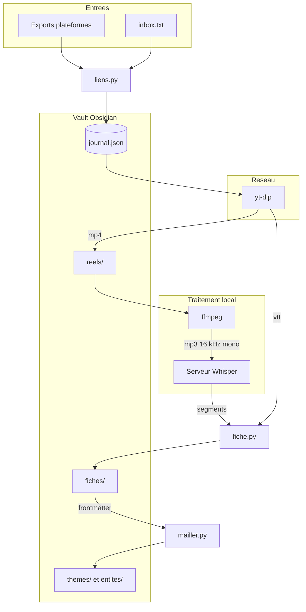

# Architecture — reels-graph-md

Le **COMMENT**. Le **POURQUOI** est dans [CADRAGE.md](CADRAGE.md).

---

## 1. Vue d'ensemble

Deux commandes en ligne de commande, sans service tournant, sans base de données.
`reels-ingest` transforme des fichiers d'export de plateformes en fiches Markdown,
`reels-mailler` en dérive le maillage Obsidian. Entre les deux, une étape
d'enrichissement conduite par un LLM remplit les champs `themes` et `entites` du
frontmatter.

Le stockage est le système de fichiers : un vault Obsidian. Le seul état structuré
est `journal.json`, qui rend l'ingestion reprenable.

Le projet n'embarque **aucune dépendance Python**. Tout le travail lourd est
délégué à trois binaires externes (`yt-dlp`, `ffmpeg`, `ffprobe`) et à un serveur
Whisper local joint en HTTP.

---

## 2. Composants

| Module | Rôle | Entrées | Sorties |
|---|---|---|---|
| [`liens.py`](../src/reels_graph_md/liens.py) | Extraction, filtrage, normalisation et identification des URLs | fichiers d'export | liste d'URLs canoniques |
| [`journal.py`](../src/reels_graph_md/journal.py) | État de traitement, reprise après interruption | URL canonique | `journal.json` |
| [`ytdlp.py`](../src/reels_graph_md/ytdlp.py) | Métadonnées et téléchargement | URL | `mp4` + `vtt` éventuel |
| [`moteur.py`](../src/reels_graph_md/moteur.py) | Pont vers le moteur de transcription du skill `watch` | fichier vidéo | segments horodatés |
| [`fiche.py`](../src/reels_graph_md/fiche.py) | Assemblage du Markdown, évaluation de fiabilité | métadonnées + transcript | `fiches/<id>.md` |
| [`inbox.py`](../src/reels_graph_md/inbox.py) | Boîte de réception du flux continu, archivage des lignes traitées | `inbox.txt` | `inbox-traite.txt` |
| [`ingest.py`](../src/reels_graph_md/ingest.py) | Orchestration, CLI `reels-ingest` | exports + inbox | vault peuplé |
| [`mailler.py`](../src/reels_graph_md/mailler.py) | Notes de thème et d'entité, wikilinks, CLI `reels-mailler` | frontmatter des fiches | `themes/`, `entites/` |
| [`verifier.py`](../src/reels_graph_md/verifier.py) | Audit et réparation, CLI `reels-verifier` | journal + disque | anomalies, remise en file |

## 3. Stack technologique

| Couche | Technologie | Version | Provenance |
|---|---|---|---|
| Langage | Python | ≥ 3.12 | [pyproject.toml](../pyproject.toml) |
| Gestion d'environnement | uv | — | convention projet |
| Build | hatchling | — | [pyproject.toml](../pyproject.toml) |
| Tests | pytest | ≥ 8.0 | groupe `dev` |
| Téléchargement | yt-dlp | 2026.07.04 (testé) | binaire système |
| Traitement média | ffmpeg / ffprobe | — | binaire système |
| Transcription | faster-whisper via serveur speaches | `Systran/faster-whisper-large-v3` (GPU) ou `deepdml/faster-whisper-large-v3-turbo-ct2` (CPU) | conteneur externe |
| Lecture du vault | Obsidian | — | client final |

Dépendances Python de production : **aucune**. C'est une contrainte assumée, voir
[CADRAGE.md §3](CADRAGE.md#3-contraintes-fermes).

---

## 4. Flux de bout en bout

1. **Extraction** — les fichiers d'export sont lus en texte brut et attaqués à la
   regex. Les URLs qui ne désignent pas un post sont écartées, les variantes de la
   même URL convergent vers une forme canonique.
2. **Filtrage** — `journal.json` retire ce qui porte déjà `statut: ok`. Les échecs
   sont automatiquement retentés.
3. **Préflight** — présence de `yt-dlp` et `ffmpeg`, puis joignabilité du serveur
   Whisper. Dans cet ordre, et **avant** le premier téléchargement.
4. **Métadonnées** — `yt-dlp --dump-json --skip-download`. L'absence de `duration`
   discrimine un carrousel photo d'une vidéo.
5. **Téléchargement** — une seule passe yt-dlp. Le mp4 est déplacé dans `reels/`.
6. **Audio** — `ffmpeg -vn -acodec libmp3lame -ar 16000 -ac 1 -b:a 64k`, en local,
   sur le fichier déjà téléchargé.
7. **Transcription** — POST multipart vers le serveur Whisper, langue forcée,
   `vad_filter` actif. Retour : segments `{start, end, text}`.
8. **Fiche** — frontmatter + vidéo embarquée + légende verbatim + transcript
   horodaté, sections de synthèse laissées en attente.
9. **Journal** — succès ou échec écrit immédiatement, puis pause anti rate-limit.

### Étape d'enrichissement

Entre la fiche brute et le maillage, un LLM lit les fiches par lots et remplit
`themes`, `entites` et les sections de synthèse. C'est la seule étape non
automatisée, et la seule qui consomme du quota. Le maillage lit ensuite le
frontmatter, pas la prose : voir la décision correspondante en §7.

---

## 5. Cycle de vie des processus

Distinction importante pour l'exploitation : le projet n'héberge **aucun service
tournant**. Ce qui tourne en permanence est une dépendance externe.

| Élément | Nature | Durée de vie | Arrêt |
|---|---|---|---|
| `reels-ingest` | Traitement par lots | Le temps du lot | Fin naturelle ou `Ctrl+C` (code `130`, reprise par le journal) |
| `reels-mailler` | Traitement par lots | Quelques secondes | Fin naturelle |
| Serveur Whisper | Conteneur Docker, **hors dépôt** | Permanente | `speaches-up.sh down` |

Le serveur Whisper est déclaré `restart: unless-stopped` dans son compose. Il
redémarre donc à chaque démarrage du démon Docker tant qu'il n'a pas été
explicitement supprimé. Conséquences pratiques :

- un `docker stop` ne suffit pas — le conteneur revient ;
- il occupe le **port 8000** en continu ;
- en mode GPU, il retient la mémoire vidéo du modèle même au repos.

C'est aussi ce qui rend le préflight de `reels-ingest` utile : le serveur est
supposé déjà là, et le script sort en code `3` avec l'instruction de démarrage
plutôt que d'échouer au premier appel de transcription, après avoir déjà
téléchargé.

**Décision** : dépendre d'un serveur persistant **plutôt que** de charger le
modèle en processus à chaque exécution (approche de reels-vault), **parce que**
sur 300 reels le modèle serait chargé 300 fois, et que cela débloque
`large-v3-turbo` là où un chargement par run impose un modèle léger. *Limite* :
une dépendance à gérer hors du dépôt, et un conteneur qui tourne en permanence.

---

## 6. Système de fichiers

Le projet n'a ni réseau Docker ni volume. Le vault produit :

| Dossier | Contenu | Écrit par |
|---|---|---|
| `fiches/` | une fiche Markdown par reel | `ingest` puis enrichi |
| `reels/` | la vidéo, conservée | `ingest` |
| `themes/` | une note par thème | `mailler` |
| `entites/` | une note par entité citée | `mailler` |
| `.temp/<id>/` | fichiers de travail, supprimés en fin de traitement | `ingest` |
| `journal.json` | état de traitement | `ingest` |

Ordre de grandeur : **1 à 3 Go** de vidéos pour 300 reels.

---

## 7. Décisions d'architecture

- **Conserver la vidéo** plutôt que ne garder que l'URL, **parce que** le post
  d'origine disparaît souvent — le retour d'expérience de reels-vault chiffre à
  environ **un tiers** les pertes sur un stock ancien, et un lien mort rend la
  fiche inutilisable comme source. *Limite* : 1 à 3 Go pour 300 reels.

- **Une seule passe de téléchargement** plutôt que deux (audio puis vidéo, comme
  reels-vault), **parce que** le rate-limit d'Instagram est le facteur limitant
  réel sur un gros stock, et que ffmpeg extrait l'audio en local pour rien.
  *Limite* : on télécharge la piste vidéo même quand seul l'audio servirait — mais
  on la conserve de toute façon.

- **Présence du fichier comme critère de succès** plutôt que le code de retour de
  yt-dlp, **parce que** celui-ci est trompeur dans les deux sens : non-zéro quand
  une piste de sous-titres échoue alors que la vidéo est là, et zéro quand rien
  n'a été produit. reels-vault ne teste aucun code de retour et produit
  silencieusement des fiches vides marquées `ok`, donc jamais retentées.
  *Limite* : un fichier tronqué passerait pour un succès.

- **Frontmatter comme source de vérité du maillage** plutôt qu'un `index.md`
  rédigé par le LLM et reparsé (approche de `graphe.py` dans reels-vault),
  **parce que** cette dernière fait dépendre le maillage du format de sortie du
  LLM : un écart de formatage casse le graphe en silence. Ici, un écart rend la
  fiche visiblement fausse. *Limite* : impose un frontmatter bien formé, d'où
  l'échappement YAML systématique.

- **Notes d'entité en plus des notes de thème**, **parce que** la recherche
  littérale d'Obsidian ne fera jamais le lien entre « vote à l'Assemblée
  nationale » et un reel qui dit « les députés ont adopté ». La note
  `[[Assemblée nationale]]` transforme une requête en navigation. *Limite* : ne
  couvre que les entités que le LLM a effectivement relevées.

- **Import du moteur de transcription** depuis le skill `watch` plutôt qu'une
  copie vendorisée, **parce que** ces scripts sont maintenus ailleurs et
  continuent d'être corrigés. *Limite* : couplage à un chemin hors du dépôt, d'où
  la variable d'échappement `REELS_GRAPH_MD_WATCH_SCRIPTS`.

- **Zéro dépendance Python** plutôt que `pyyaml` + `requests`, **parce que** le
  besoin réel se limite à des scalaires et des listes plates côté YAML, et que le
  moteur importé fait déjà son multipart en stdlib. *Limite* : parseur de
  frontmatter maison, volontairement partiel.

- **Langue forcée** plutôt qu'autodétectée, **parce que** sur un clip court avec
  de la musique, Whisper se trompe régulièrement de langue et rend un transcript
  inexploitable. *Limite* : un corpus multilingue exigerait un passage par
  `--langue` par lot.

---

## 8. Sécurité

| Durcissement | Effet |
|---|---|
| Aucune clé d'API dans le projet | Rien à fuiter ; la transcription est locale |
| Cookies jamais persistés | `yt-dlp --cookies-from-browser` lit le profil, le projet n'écrit rien |
| `.gitignore` couvrant `exports/`, `saved_posts*.json`, `user_data_tiktok*.json`, `cookies.txt` | Les exports contiennent des données personnelles et ne peuvent pas partir dans le dépôt par accident |
| Écriture atomique du journal | Une coupure ne laisse pas de journal tronqué |
| Aucun appel réseau sortant hors plateformes et `localhost` | Le contenu des reels ne quitte pas la machine |

Le seul secret manipulé est le cookie de session des plateformes, lu directement
dans le profil du navigateur au moment de l'appel.

---

## 9. Limites connues et pistes

| Aspect | Limitation actuelle | Piste |
|---|---|---|
| Chemin réseau | Non testé automatiquement sur les trois plateformes ; Instagram et Facebook exigent des cookies | Test manuel sur un lot de 10 avant tout lot volumineux |
| Export Facebook | Structure du fichier non confrontée à un export réel ; le filtre couvre `/reel/`, `/watch?v=`, `/share/r/`, `fb.watch/` | Valider sur un export réel, élargir `MOTIFS_CONTENU` si besoin |
| Granularité des horodatages | Whisper peut rendre un segment unique pour un clip court, réduisant le transcript à un seul repère `[00:00]` | À mesurer sur de vrais reels ; découpage forcé si le besoin se confirme |
| Enrichissement | Étape manuelle par construction, non déterministe | Procédure dans [ENRICHISSEMENT.md](ENRICHISSEMENT.md) |
| Recherche sémantique | Absente. La navigation par thème et par entité fonctionne, pas la question en langage naturel | Décision ouverte, voir [CADRAGE.md §6](CADRAGE.md#6-décisions) |
| Carrousels photo | Ni audio ni transcript ; la fiche se réduit à la légende | Hors périmètre assumé (pas d'analyse visuelle) |
| Détection de troncature | Un fichier vidéo incomplet passe pour un succès | Contrôle `ffprobe` de la durée contre celle des métadonnées |
| Source de vérité | La liste de travail est recalculée à chaque lancement : les exports doivent rester disponibles | Documenté dans [GUIDE.md](GUIDE.md) ; une file persistante serait une alternative |
| Fichier `LICENSE` | Absent du dépôt alors qu'il est public | À ajouter (MIT) sur décision explicite |
